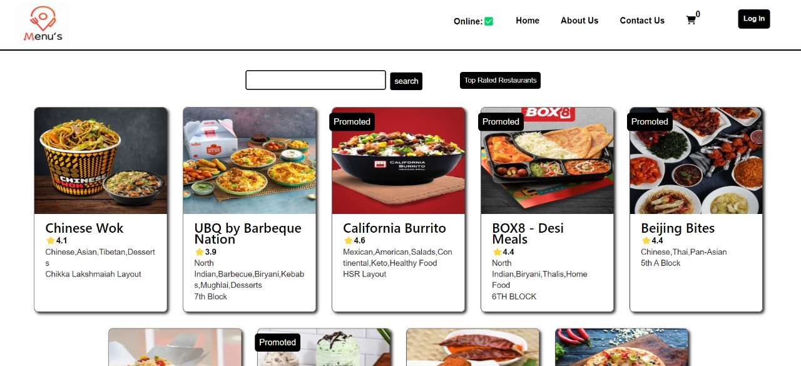
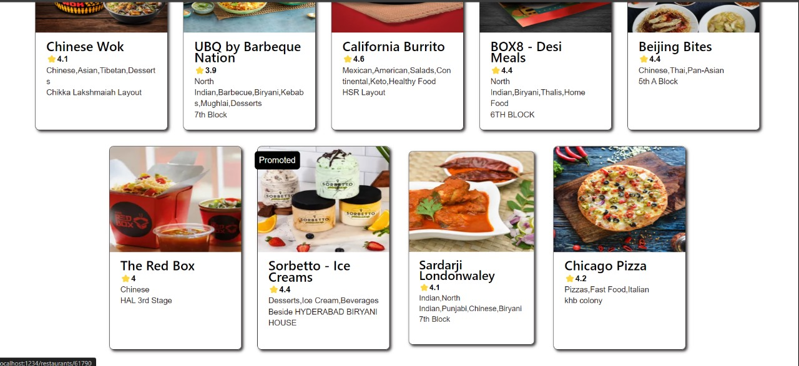
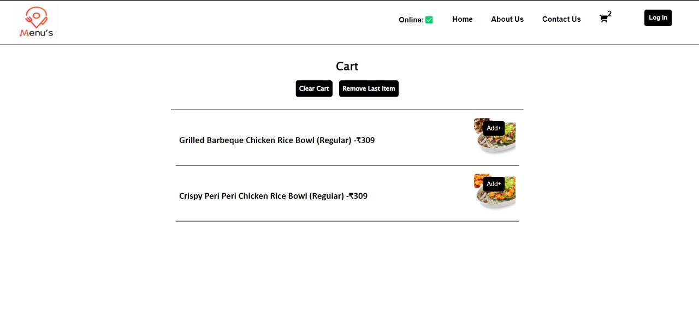

# Food Ordering App

A web application built with React, Redux, and Parcel for ordering food online. The app utilizes the Swiggy API to fetch restaurant data, allowing users to search for
restaurants, filter by top-rated options, and place orders. It also includes features such as online-offline functionality, a shopping cart for adding and removing 
items, and user authentication using Auth0.

## Screenshots

## Features

- **React & Redux**: Utilizes React for building user interfaces and Redux for managing application state.
- **Parcel Bundler**: Uses Parcel as a bundler for building the application.
- **Swiggy API Integration**: Fetches restaurant data from the Swiggy API to provide users with a selection of options.
- **Search and Filter**: Allows users to search for restaurants and filter by top-rated options.
- **Online-Offline Functionality**: Supports online-offline functionality to ensure seamless user experience.
- **Shopping Cart**: Enables users to add items to their cart and remove them as needed.
- **User Authentication**: Implements authentication using Auth0 for secure login and signup functionality.
